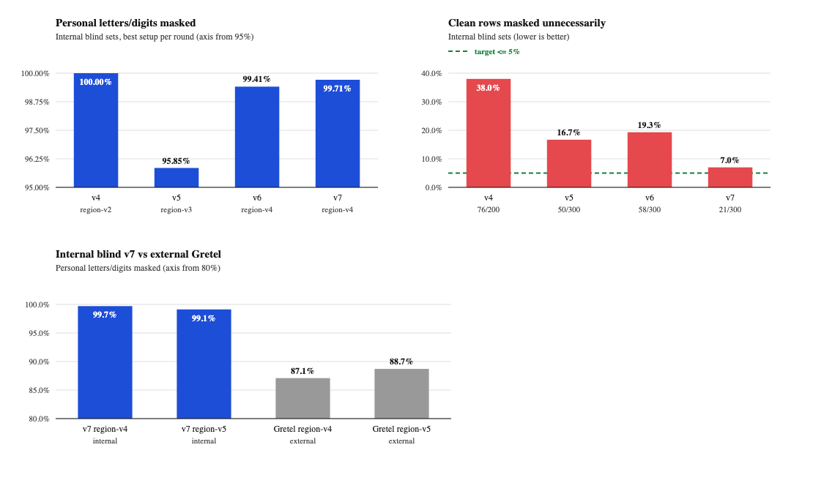

# PrivacyGate

Offline multilingual PII masking research prototype for English, German, French, Italian and Spanish (EN/DE/FR/IT/ES). It combines an mBERT region model with deterministic rules to mask personal information while limiting unnecessary masking.

Synthetic data only. This is not a production privacy control and provides no privacy or legal guarantee. The external evaluation—not the near-perfect internal scores—is the honest headline: **87.09–88.71% of annotated personal letters/digits masked**, with **4.04–4.42% excess masking on non-annotated text**.

## How it works

The full pipeline keeps candidate spans in original-text coordinates:

```text
mBERT region model → regex + structured detectors → context gate
→ address/name assemblers → refinement + coverage union → render
```

The model proposes regions; rules detect and validate structured values; the context gate distinguishes personal from operational uses. Assemblers extend address/name regions and propagate supported name mentions within a document. Refinement and union combine accepted spans before rendering placeholders. Required-stage or inference failures return a blocked result rather than silently falling back to regex.

`full` is the only supported profile (`privacygate.pipeline.run_pipeline(text, profile="full", model_dir=None, options=None)`). Three opt-in, inference-only options apply to it: `name_threshold` (0 < t ≤ 1; summed B/I PERSONNAME probability override), `name_propagation_ext` (wider in-document name propagation) and `ensemble` (probability average of the sibling `region-v4-2ep`/`region-v5-2ep` pair). The `structured`, `structured_address_names`, `legacy_union_refined` and `full_calibrated` profiles and the CLI `hybrid` engine are retired; their results remain in `artifacts/runs/` and git history. `configs/pipeline-v1.json` still lists the retired profiles because blind-run manifests bind its sha256. The CLI defaults to the regex engine, not the pipeline.

## Repository layout

```text
privacygate/                     # method: stable public API and region training
├── cli.py, __main__.py          # stdin → JSON interface (python -m privacygate)
├── pipeline.py                  # staged orchestration; run_pipeline
├── model/                       # inference adapter, mBERT wrapper (hybrid.py), run guard
├── rules/, assemblers/          # structured detection, context, refinement; addresses, names
├── data/                        # spans, region JSONL loader, window alignment
├── training/                    # train_mbert.py (region trainer), colab_bundle.py
└── detect.py, mbert_data.py, masking_metrics.py
data/
├── generators/                  # frozen generators: masking-stress v7 (v8 template), train-v6
├── manifests/                   # hash-bound manifests: masking-stress-v7.json, train-v6.json
└── local/                       # git-ignored datasets (see below)
evaluation/
├── evaluate_pipeline.py         # custody-bound blind scoring through run_pipeline
├── evaluate_external.py         # Gretel EXT-DEV grid / TEST, v7 development check
├── masking_eval.py              # aggregate scorer and blind custody
└── checks/                      # regression checks and verify_frozen.py
colab/train_region_v6.ipynb      # Colab GPU training notebook for region-v6
configs/                         # pipeline and privacy policy configuration
artifacts/                       # aggregate metrics, manifests and receipts; figures/results.png
smoke.py                         # deterministic CLI smoke test
```

Git-ignored local assets (never committed):

```text
data/local/augmentation/         # masking-stress-v7.jsonl, train-v6.jsonl, dev-v6-ext.jsonl
data/local/external/             # gretel-finance-7b844d1/ and other external test sets
data/local/artifacts/            # default for $PRIVACYGATE_ARTIFACTS (train-v5 subset, frozen scorer copy)
models/                          # region-v4-2ep, region-v5-2ep, full-1, new runs
.cache/hf/                       # Hugging Face cache (HF_HOME); .cache/ext-step1-probabilities/
```

`$PRIVACYGATE_ARTIFACTS` points at the owner's external artifact folder; the train-v6 generator reads `train-v5/train-v5.jsonl` and `external/gretel-results/evaluate_external.py` from it (default `data/local/artifacts`).

Frozen bindings: the v7 generator's manifest binds the generator's own bytes, so the file is never edited; `evaluation/checks/verify_frozen.py` maps the current layout onto the paths recorded in the manifests at runtime only. `data/manifests/train-v6.json` binds the train-v6 code in `code_inputs` (refreshed after this layout change; data hashes unchanged). `privacygate/model/hybrid.py` is kept byte-identical because the external-evaluation probability cache key binds its sha256. Retired code (OpenPII Micro mode, stress v1–v6, train-v2–v5, challenge/window-cut/positive/negative sets, audits) remains in git history at `891ed19`.

Project notes, protocols and reports live outside the repository in ProjectOS project `10-Projects/privacygate`; only the root README and AGENTS are repository notes.

## Evaluation method

Each internal round used a fresh synthetic blind set, separate from development data. Each model/profile arm was measured once, with hash-bound manifests and custody receipts preventing repeat scoring. Later rounds used revised models/rules, so their results are not a controlled comparison on one common test set. Previously scored sets are no longer blind.

The primary masking metric is the share of annotated personal letters/digits covered by the final mask, independent of the predicted label. It is not exact-span F1 or the percentage of documents fully protected. A clean row counts as masked if any text is masked.

The external test used a synthetic dataset **we did not generate**, with one measurement per arm and no training on that test. Excess masking is masked characters outside all source annotations divided by all non-annotated characters. This character rate is not directly comparable to the internal clean-row rate; missing annotations can also inflate it.

## Results



### Internal blind sets

Best setup per round, with the region-v5 challenger shown separately:

| Blind set | Setup (`full`) | Personal letters/digits masked | Clean rows masked |
|---|---|---:|---:|
| v4 | region-v2 | 100.00% | 76/200 |
| v5 | region-v3 | 95.85% | 50/300 |
| v6 | region-v4 | 99.41% | 58/300 |
| v7 | region-v4, round-4 rules | 99.71% | 21/300 (7.0%) |
| v7 challenger | region-v5, round-4 rules | 99.13% | 19/300 |

Aggregate records and receipts are in `artifacts/runs/blind-v4/` through `blind-v7/`. These internal blind sets **overstate quality** relative to external text.

### External test — the headline result

`gretelai/synthetic_pii_finance_multilingual`, Apache-2.0, commit `7b844d1`; test split restricted to EN/DE/FR/IT/ES: **4,696 documents and 12,200 in-scope spans**, measured once per arm using `full`.

| Model | Personal letters/digits masked | Excess on non-annotated text |
|---|---:|---:|
| region-v4 | 87.09% | 4.04% |
| region-v5 | 88.71% | 4.42% |

Person names without cues were a major weakness (roughly 81–85% coverage); usernames were also weak. Excess masking was mostly numbers/amounts. The annotations are LLM-made, with automated validation and reported spot checks—not a fully human-adjudicated reference. External aggregates, manifests and measurement tooling are retained outside the repository under `$PRIVACYGATE_ARTIFACTS/external/gretel-results/` (`external-gretel.json`); the EXT-DEV selection and the single Gretel TEST measurement made with the current tooling are in `artifacts/runs/ext-step1/`.

## Limitations

- Synthetic-only research does not establish performance on real personal data or unseen domains/languages.
- Character coverage can hide partially leaked values and fully unprotected documents. An `ok` status certifies processing, not complete PII recall.
- Names without contextual cues, usernames and ambiguous numeric fields remain failure modes. Wider masks trade recall against retained utility.
- External annotations can omit or misclassify values; some mapped labels do not establish personal linkage. Scope differences limit comparisons with internal tests.
- Provenance, annotation-quality and final split gates remain open. No deployment, anonymization or legal compliance claim is made.

## Usage and reproduction

Run commands from the repository root. The default regex engine requires only Python >=3.9 and detects EMAIL and checksum-valid IBAN values. The mBERT engine, the staged pipeline and training additionally require `requirements-train.txt` (including `phonenumberslite`, used by structured phone validation), local model weights and a populated tokenizer cache. Missing assets fail without a silent regex fallback.

```sh
python3 -m venv .venv-train
.venv-train/bin/pip install -r requirements-train.txt -e .

export PYTHONDONTWRITEBYTECODE=1 HF_HUB_OFFLINE=1 TRANSFORMERS_OFFLINE=1
export HF_HOME="$PWD/.cache/hf"                 # populated bert-base-multilingual-cased snapshot
export PRIVACYGATE_ARTIFACTS=/path/to/external/artifacts   # only for train-v6 generation
PY=.venv-train/bin/python
```

Smoke test and checks (no model needed except where noted):

```sh
$PY smoke.py
$PY -m evaluation.checks.check_structured
$PY -m evaluation.checks.check_context
$PY -m evaluation.checks.check_address
$PY -m evaluation.checks.check_names
$PY -m evaluation.checks.check_window_alignment
$PY -m evaluation.checks.check_eval
$PY -m evaluation.checks.check_pipeline --model-dir models/region-v4-2ep   # needs a region model
$PY -m evaluation.checks.verify_frozen all        # v7 and train-v6; missing data is reported as skipped
```

Masking (synthetic input only):

```sh
$PY -m privacygate --help
$PY -m privacygate --pipeline-profile full --model-dir models/region-v4-2ep < synthetic-input.txt
```

The CLI reads text from stdin and emits JSON with `masked_text` and `entities` (original-text offsets and labels, not original entity values or confidences). Staged results also include status, completion and aggregate diagnostics. Unmasked text remains in the output, so this output is not a safe-to-log privacy guarantee.

- `--engine regex|mbert`: non-staged engine selection; default `regex`.
- `--model-dir PATH`: local checkpoint; default `models/full-1` when unspecified.
- `--pipeline-profile full`: opt into staged processing; overrides engine/refinement/confidence options.
- `--refine` and `--confidence`: optional mbert-engine controls; see CLI help.

Data generation and verification:

```sh
$PY data/generators/make_train_v6.py              # writes data/local/augmentation/{train-v6,dev-v6-ext}.jsonl; refuses to overwrite
$PY -m evaluation.checks.verify_frozen train-v6   # full replay against data/manifests/train-v6.json
$PY -m evaluation.checks.verify_frozen v7         # v7 is frozen; copy its generator as the template for v8
```

Region training (same settings as the region-v6 run):

```sh
$PY -m privacygate.training.train_mbert --run region-v6-2ep-b8 \
  --region-train-file data/local/augmentation/train-v6.jsonl \
  --region-dev-file data/local/augmentation/dev-v6-ext.jsonl \
  --region-manifest data/manifests/train-v6.json --epochs 2 --batch-size 8
```

The trainer picks `cuda`, then `mps`, then `cpu` (device and GPU name are recorded in `metrics.json`), refuses inputs whose sha256 differs from the manifest, and never overwrites an existing run directory under `models/`.

Colab GPU training (region-v6): build the bundle on the Mac, upload it to Google Drive as `privacygate/colab-bundle-v6.zip`, then run `colab/train_region_v6.ipynb` top to bottom on a GPU runtime. The bundle holds the `privacygate` package, `requirements-train.txt`, the train-v6 manifest, both data files and `SHA256SUMS`; it refuses `data/raw/`, `models/` and any checkpoint folder. The notebook verifies every hash, installs missing pins, downloads the pinned base model, trains with the command above (output on Drive, since free sessions can drop and there is no mid-epoch checkpoint), prints `metrics.json` and writes `region-v6-2ep-b8.zip` to Drive.

```sh
$PY -m privacygate.training.colab_bundle --out ~/colab-bundle-v6.zip
```

External and development evaluation (Gretel `gretel-finance-7b844d1` parquet files in `data/local/external/`):

```sh
# EXT-DEV inference-only option grid (selection only; TEST text hashes only):
$PY evaluation/evaluate_external.py --split ext-dev --grid --out artifacts/runs/<round>/ext-dev-grid.json
# Locked selection: v7 development check, then the single TEST measurement:
$PY evaluation/evaluate_external.py --split test --selection artifacts/runs/<round>/ext-dev-grid.json \
  --v7-out artifacts/runs/<round>/v7-dev --out artifacts/runs/<round>/gretel-test/metrics.json
# Custody-bound blind scoring through run_pipeline (one measurement per profile+model):
$PY evaluation/evaluate_pipeline.py --version v7 --dataset data/local/augmentation/masking-stress-v7.jsonl \
  --model-dir models/<model> --out-dir <fresh output dir>
```

`artifacts/runs/ext-step1/` records how the current EXT-DEV selection, v7 development check and Gretel TEST measurement were produced. Evaluators retain JSON outputs and print aggregate summaries, not dataset rows. Historical blind arms must not be rerun; reproduce their reported numbers from the committed aggregates and receipts. Training requires separate authorization even though the trainer entry point is available.
